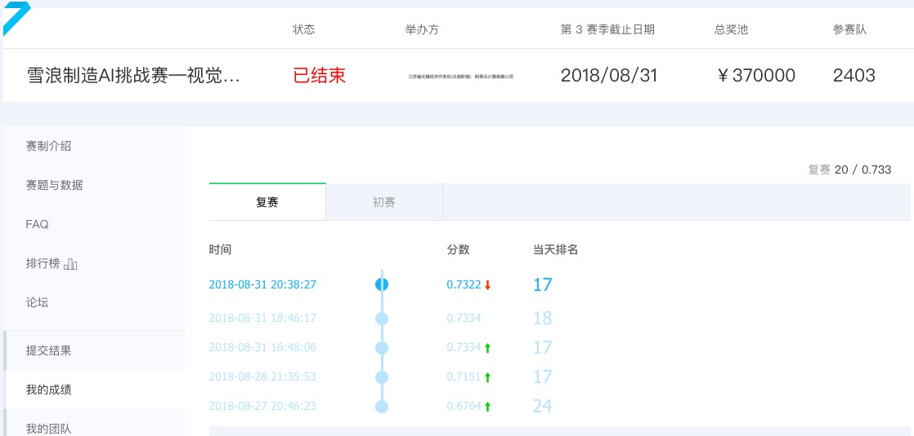

#雪浪制造AI挑战赛—视觉计算辅助良品检测（布匹质检）  

##比赛信息
* 使用深度学习模型对布匹检测判断是否为瑕疵布匹，并且进一步判断是哪一种瑕疵。本次大赛要求选手开发算法模型，通过布样影像，基于对布样中疵点形态、长度、面积以及所处位置等的分析，判断瑕疵的种类 。通过探索布样疵点精确智能诊断的优秀算法，提升布样疵点检验的准确度，降低对大量人工的依赖，提升布样疵点质检的效果和效率。
* [比赛链接](https://tianchi.aliyun.com/competition/introduction.htm?spm=5176.11409106.5678.1.6a5610cbdyREgF&raceId=231666)
* 复赛中取得20/2403名的成绩

##实验环境
* 操作系统：win10
* python 3.5 keras 2.2.0
* 编译器 spyder

##思路说明  
* 本次比赛使用主要使用迁移学习和yolo_v3两个模型进行预测，然后对结果取平均。
* 迁移学习：  
  * 使用inception_v3做迁移学习，将模型导出的结果做GlobalAveragePooling得到一个1024维的向量，然后直接使用densenet(全连接层）到11维的向量。这里尝试过先添加512维的全连接层再添加11维的全连接层，效果并不好,(可能是因为inception本身是没有新添一个全连接层的)。使用softmax激活函数，logloss做损失函数。
  * 训练过程：先把inception\_v3所有层都冻结，只对最后的一层进行训练，训练50个epoches后。finetune即使用对所有的层都进行训练，使用较小的学习率训练50个epoches，这样有助于先学习到最后一层（分类层）的权重。训练时使用early stop和learning\_rate decay用val\_loss做监视指标。  
* yolov3：
  * yolov3的实现代码参照[该链接](http://github.com)
  * 在训练的过程中对模型进行了一部分改动，由于我们的问题瑕疵较少，一张图片可能没有或只有一个瑕疵，因此背景的概率增大了。我对损失函数进行修改，将背景的损失乘上0.1.
  * 原文件无法输出每张图的种类概率，我将detect_img函数的输出增加了output,3个尺寸的结果，13\*13,26\*26,52\*52大小的特征图，每个点包含(objectness+(width,height,x,y)+class probability)*anchor numbers. 提取出特征图上objectness最大的5个点，并求出它们的class probability 然后做平均得到当前这张图的预测概率。
  